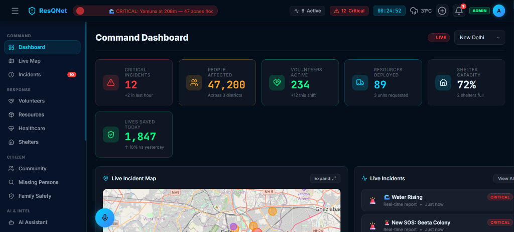
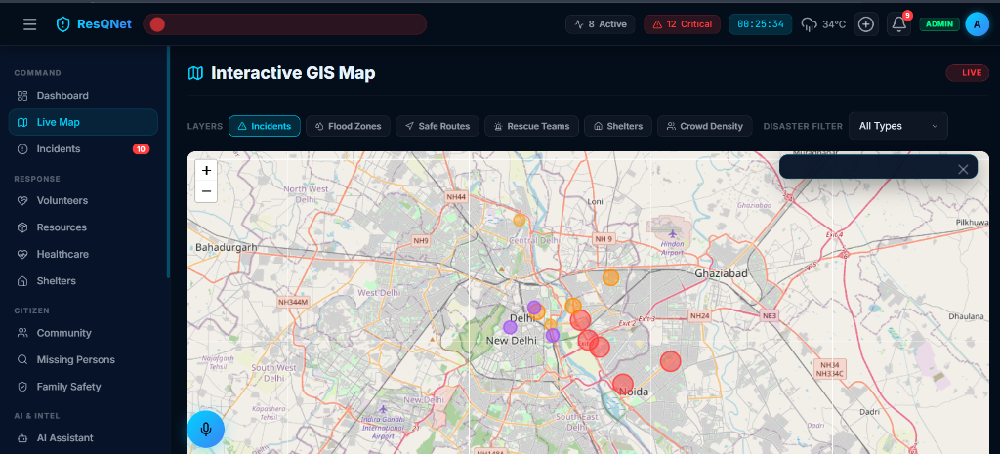
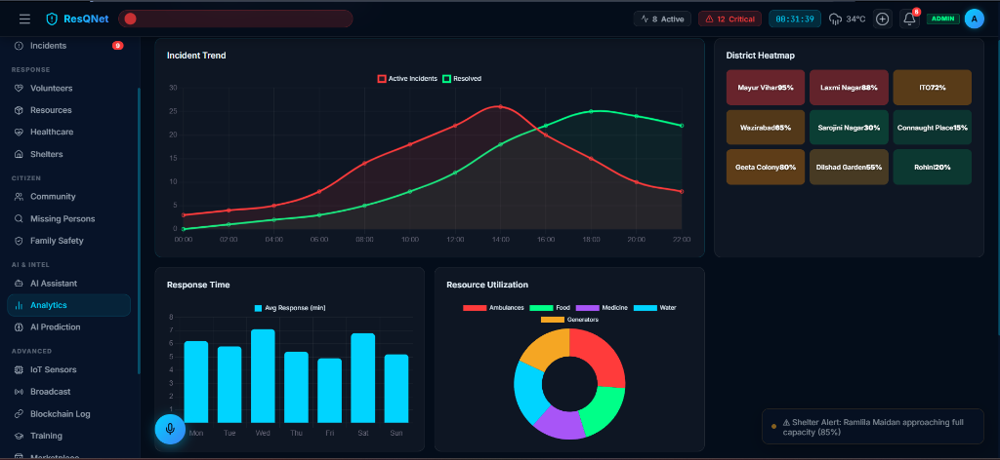
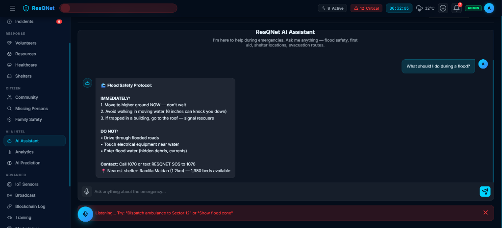
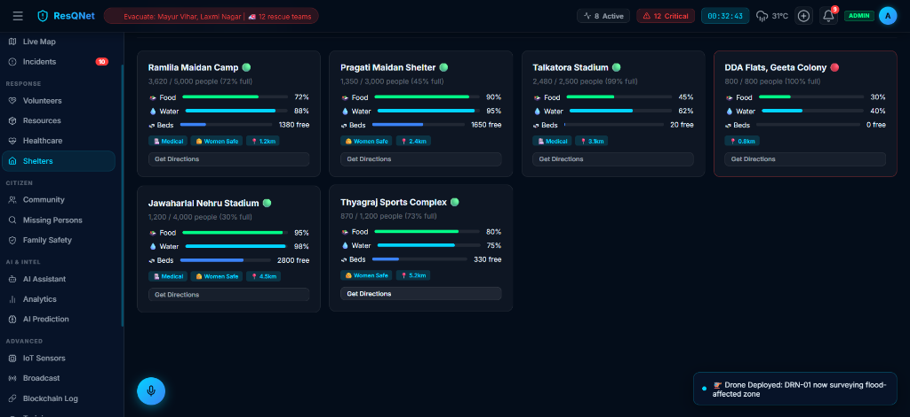
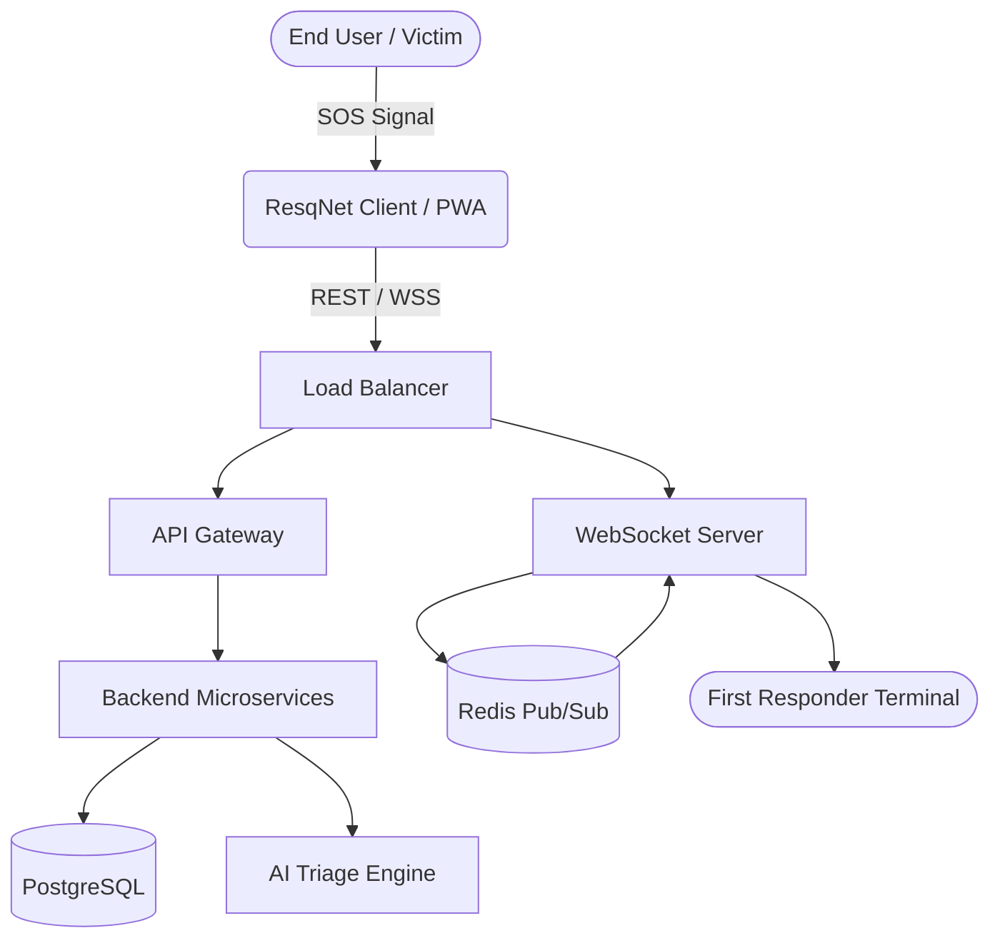
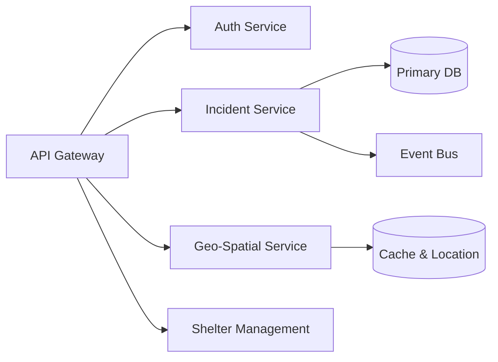
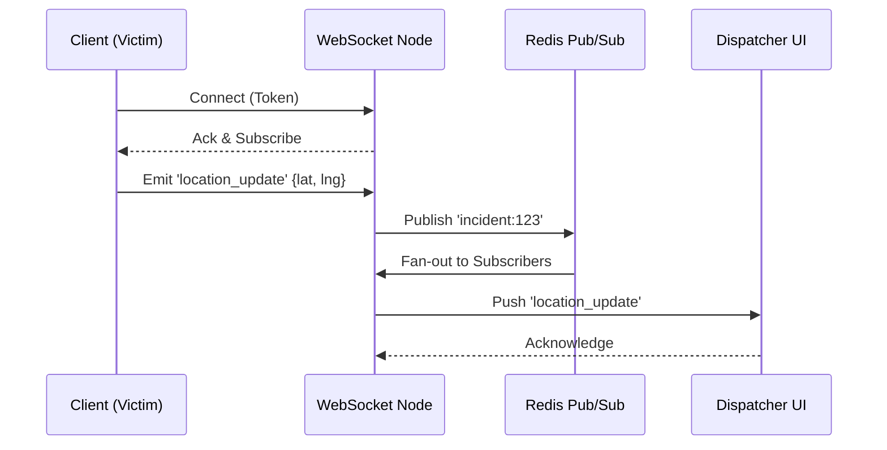

<div align="center">
  
  <h1>ResqNet</h1>
  <p><em>Next-Generation Real-Time Disaster Response & Coordination Platform</em></p>
  
  [](http://creativecommons.org/licenses/by-nd/4.0/)
  [](https://rishisharma029.github.io/resqnet)
  <br/>
  [](https://github.com/Rishisharma029/resqnet)
  [](https://github.com/Rishisharma029)
  <br/>
  [](mailto:i.rishisharma2007@gmail.com)
</div>

<br />

## 🌍 Project Intro

**ResqNet** is an advanced, real-time emergency management and coordination system designed to bridge the gap between distressed individuals, first responders, and command centers during critical disaster events. By leveraging real-time geospatial tracking, AI-assisted incident analysis, and high-availability websocket communications, ResqNet empowers teams to make data-driven decisions when every second counts.

<p align="center">
  
</p>

---

## 📸 Screenshots

| Dashboard Overview | Live Tracking Map |
|:---:|:---:|
|  |  |
| **Command Center Analytics** | **AI Assistant & Incident Triage** |
|  |  |

<div align="center">
  <strong>Shelter Capacity & Management System</strong><br>
  
</div>

---

## 🏗️ Architecture Diagrams

ResqNet uses a distributed architecture to ensure high availability and low latency during peak traffic (disaster events).

### System Flow Diagram


### Backend Services Diagram


### WebSocket Flow (Real-Time Communication)


---

## ✨ Features

- **Real-Time Incident Dashboard**: Bird's-eye view of all active incidents, severity levels, and resource allocations.
- **Geospatial Tracking (Map)**: Live tracking of responders, assets, and SOS signals on an interactive 3D map.
- **Advanced Analytics**: Post-incident reports, response time heatmaps, and resource utilization metrics.
- **AI Assistant**: NLP-based triage system that prioritizes incidents based on incoming distress text/audio.
- **Shelter Management System**: Real-time capacity tracking, inventory management, and routing for displaced persons.
- **Offline Capabilities**: Core functionalities are cached via PWA for intermittent connectivity zones.

### 🧪 Simulated Features
*To demonstrate the full potential of the architecture without requiring hardware integrations, the following features are simulated within the platform:*
- **Drone Feeds**: Pre-recorded aerial footage fed through the streaming pipeline.
- **Satellite Monitoring**: Historical thermal anomaly data replayed as real-time events.
- **Blockchain Logging**: Simulated immutable ledger transactions for audit trails.
- **Thermal AI**: Mocked object detection bounding boxes on thermal video feeds.

---

## 🛠️ Tech Stack

**Frontend:**
- React (Vite) / Next.js
- Tailwind CSS
- Mapbox GL JS / Deck.gl
- Socket.io-client / Zustand

**Backend:**
- Node.js (Express / NestJS)
- PostgreSQL (PostGIS)
- Redis (Pub/Sub & Caching)
- Socket.io
- Prisma ORM

**Infrastructure (Simulated/Planned):**
- Docker & Kubernetes
- AWS (EC2, S3, RDS)
- NGINX

---

## 🚀 Installation & Setup

1. **Clone the repository**
   ```bash
   git clone https://github.com/Rishisharma029/resqnet.git
   cd resqnet
   ```

2. **Environment Variables**
   ```bash
   cp .env.example .env
   # Update .env with your specific keys (DB, Mapbox, etc.)
   ```

3. **Install Dependencies**
   ```bash
   # Install server dependencies
   cd server
   npm install

   # Install client dependencies
   cd ../client
   npm install
   ```

4. **Run the Application**
   ```bash
   # In terminal 1 (Backend)
   cd server
   npm run dev

   # In terminal 2 (Frontend)
   cd client
   npm run dev
   ```

---

## 🗺️ Roadmap

- [x] Phase 1: Core authentication and basic SOS routing.
- [x] Phase 2: Real-time map integration and WebSocket setup.
- [ ] Phase 3: AI Assistant NLP integration for automatic triage.
- [ ] Phase 4: Mobile App (React Native) deployment for offline-first usage.
- [ ] Phase 5: Hardware integration (IoT sensors, actual drone feeds).

---

> **Note on Commits & Contribution:**
> This repository follows conventional commit standards. 
> Example: `feat: implement realtime incident dashboard`, `refactor: optimize websocket event handling`.
